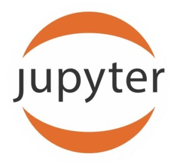
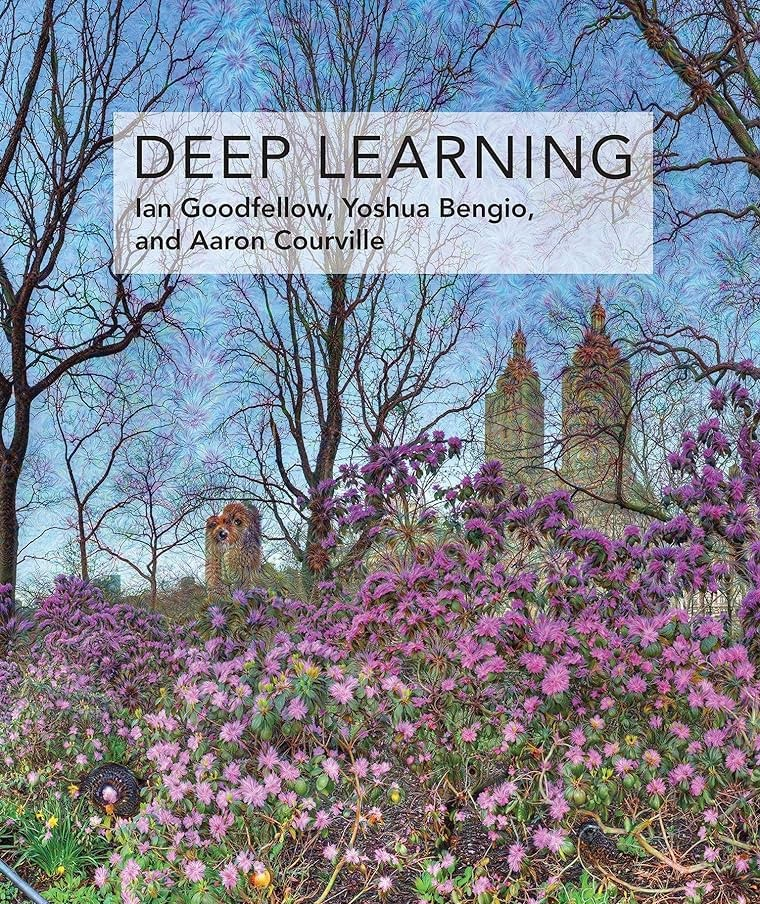

# 
**Advanced Machine Learning ** 

<a href="https://hassothea.github.io/">Dr. HAS Sothea</a>

2025-10-22

- [Introduction](#introduction)
- [Course Criteria](#course-criteria)
- [Course Sections](#course-sections)
- [Midterms, Exams and Projects](#midterms-exams-and-projects)
- [Resources and Further Reading](#resources-and-further-reading)

# 👋 Introduction

Welcome to the **Advanced Machine Learning** course! This course is
designed to provide an in-depth understanding of advanced topics in
machine learning, including data comprehension, advanced machine
learning methods, optimization approaches, what to watch out when
working with each machine learning model, and more. By the end of this
course, you will have a solid grasp of various types of datasets,
machine learning techniques and be able to apply them to real-world
problems.

------------------------------------------------------------------------

# 📝 Course Criteria

| **`Criteria`**               | **`Percentage`** |
|:-----------------------------|:----------------:|
| Attendance                   |       10%        |
| Participation & quiz         |       30%        |
| Midterm Exam                 |       30%        |
| Final Project & Presentation |       30%        |

> ⌨️ Programming: <a href="https://www.python.org/" target="_blank"> src="./img/python.png" style="position: relative; bottom: 0px"
> width="30" /></a> `Python` with the following main tools and modules:

- <a href="https://docs.jupyter.org/en/latest/" target="_blank"> Jupyter Notebook</a>
- 
- <a href="https://scikit-learn.org/stable/" target="_blank"> Scikit-learn</a>
- <a href="https://pytorch.org/" target="_blank"> Pytorch</a> …

------------------------------------------------------------------------

# 📋 Course session

> **Visit the course webpage:** <a href="https://hassothea.github.io/Advanced-Machine-Learning-ITC/" target="_blank">M1-DAS: EDA & Unsupervised Learning</a>

# Midterms, Exams and Projects

In this section, you will find all the information related to the
midterms, exams and projects including instructions, starting dates and
the deadlines.

------------------------------------------------------------------------

# 📚 Resources and Further Reading

Here, you will find additional resources, including books, research
papers, and online courses, to further your understanding of advanced
machine learning.

👉� You will find these books helpful…

 

 

------------------------------------------------------------------------
